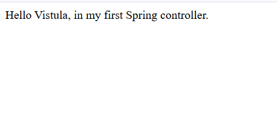
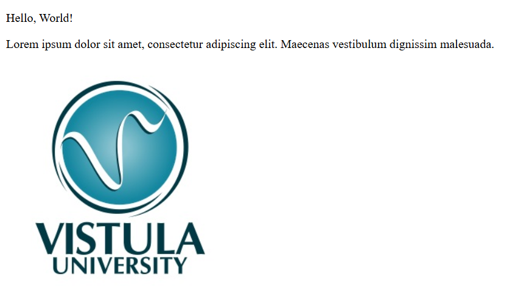
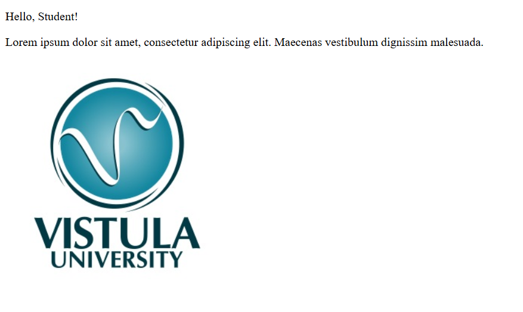

# Task 1: First Spring Project

This is my first project for the Java Spring course. It is a web application that uses Controllers to show text and images.

## Technologies
* Java 21
* Spring Boot
* Maven

## How to Run
1.  Open the project in IntelliJ.
2.  Run the command: `./mvnw spring-boot:run`
3.  Open your browser to the links below.

## App Links (Endpoints)

Here are the three pages I created for this task:

### 1. Home Page
Shows the welcome text and the Vistula logo.
* **Link:** http://localhost:8080/
* Result: 

### 2. Standard Greeting
Shows a default greeting message.
* **Link:** http://localhost:8080/greeting
* Result:

### 3. Custom Greeting
Shows a greeting using the name "Student".
* **Link:** http://localhost:8080/greeting?name=Student
* Result: 